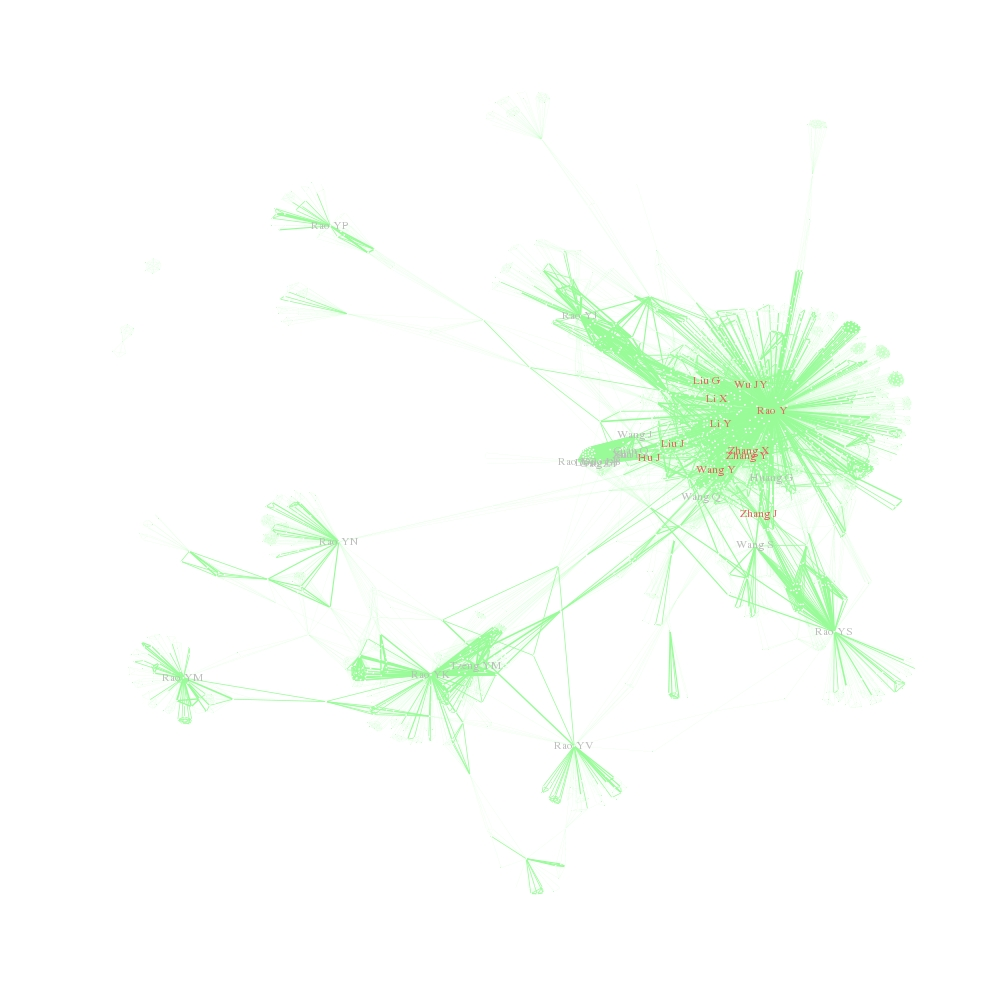

# ScientistNetwork
### author: "Kehao Wu"
### date: "2015/2/28"

:flushed:At first, please forgive my poor English expression.

An idea that to illustrate social network of scientists using R  comes into my mind.  [My Blog](http://blog.sina.com.cn/s/blog_403aa80a0102vt0j.html)

In thie picture, you could find some funny phenomenon. Such as, some guys whose name is very similar to Rao Y have appeared in this social network. I am not sure whether it come from bugs or it could reveal some facts.

1. The co-author relationship maybe could tell us something about their social network. Thus, I obtained the query result from pubmed with Entrez Programming Utilities. More details about Entrez Programming Utilities, please [see](http://www.ncbi.nlm.nih.gov/books/NBK25501/)

2. RCurl and XML package were available tools to handle E-utilities in R.

3. Function GraspData was construct to obtain data from pubmed. You can obtain query result for keyword 'Rao Y' [Rao Yi is a Chinese neurobiologist](http://en.wikipedia.org/wiki/Rao_Yi) like this:

> keyPerson = "Rao Y"
>
> relationSet = GraspData(keyPerson = keyPerson)

4. After you obtain data, you could process these result using function Construct. We define link between two persons as their names appeared in a same paper. The paper with authors list without key person would be excluded from analysis. The cutoff option mean the links between certain two persons should appears much more times than cutoff times. In this example, all data would be included.

> relationData = Construct(relationSet = relationSet,cutoff = 0)

5. At last, we displayed their social relationship as a network graph using igraph package in R

> g = Graph(data = RelationData,keyPerson = keyPerson)

6. Welcome everyone come to contribute your codes to make it more perfect.